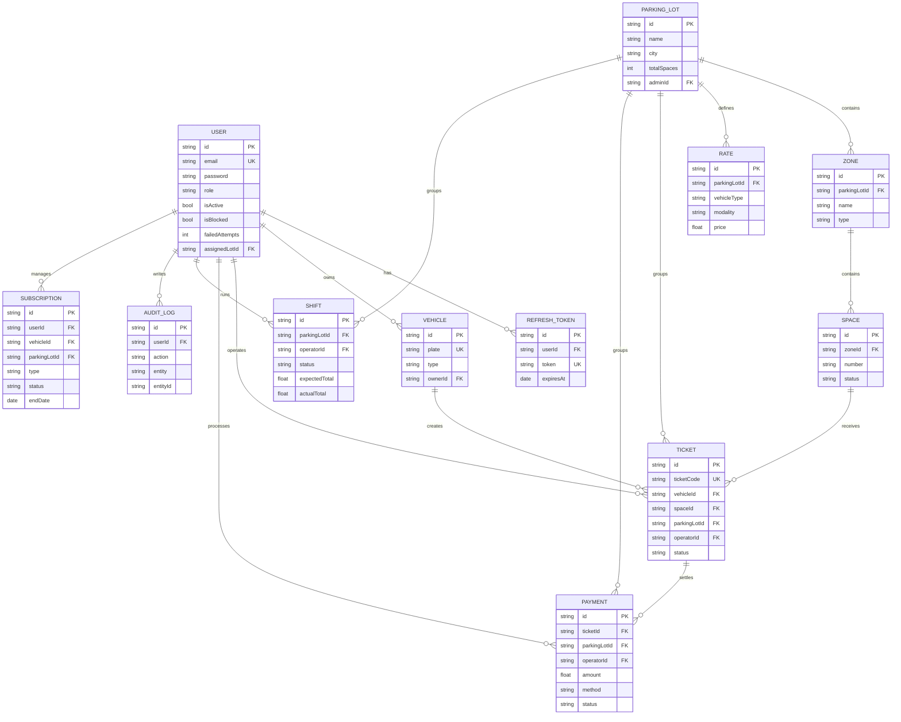

# ParkingOS


Sistema de gestion de parqueadero comercial con enfoque operativo real: entradas/salidas, turnos, caja, tarifas, usuarios por sede y trazabilidad.

## Stack real de este repo (Mar 2026)

- Next.js 16 (App Router)
- React 19 + TypeScript 5
- Prisma 7 + PostgreSQL
- JWT + RBAC
- Tailwind CSS 4 + componentes UI propios

## Estado del proyecto (Mar 2026)

### Implementado

| Modulo | Estado | Detalle |
|---|---|---|
| Autenticacion y RBAC | COMPLETO | JWT · roles · guards |
| Dashboard operativo | COMPLETO | Espacios · ingresos · KPIs en tiempo real |
| Gestion del parqueadero | COMPLETO | Zonas · espacios · mapa interactivo |
| Tickets (entrada / salida) | COMPLETO | QR digital · busqueda por placa · estados |
| Turnos y operadores | COMPLETO | Apertura · cierre · cuadre de caja |
| Pagos en caja | COMPLETO | Efectivo · calculo de tarifa · vuelto |
| Pagos digitales (Stripe) | PARCIAL | Checkout base habilitado; faltan reintentos, proteccion replay y facturacion PDF |
| Reportes | COMPLETO | Ocupacion · ingresos · exportacion CSV |
| Gestion de usuarios | COMPLETO | CRUD · asignacion de roles · sede |
| Suscripciones mensuales | COMPLETO | Renovacion manual + mantenimiento automatico |
| Permisos residentes/empleados/visitantes | COMPLETO | Roles RESIDENT/EMPLOYEE/VISITOR documentados |
| Validacion de permisos en entrada | COMPLETO | Auto-ingreso si suscripcion activa (RESIDENT/EMPLOYEE); VISITOR sigue flujo pago |
| Espacios asignados y reservados | COMPLETO | Reserva fija por usuario, se libera a RESERVED al salir |
| Notificaciones en tiempo real | COMPLETO | SSE por usuario + actualizacion live en centro de notificaciones |
| API publica v1 | COMPLETO | Endpoint de tickets con API key y scopes |
| Auditoria | COMPLETO | Bitacora · timestamp · diff de acciones |
| Settings | COMPLETO | Config general · tarifas · parametros |
| Perfil de usuario | COMPLETO | Vista perfil y contexto de sesion |
| API publica y webhooks | PARCIAL | v1 básica: un endpoint de lectura (tickets) + 3 eventos (ticket.created, payment.completed, shift.closed), sin reintentos. |
| Notificaciones reales | COMPLETO | Email SMTP transaccional, SMS Twilio y Webhooks push SSE. |

### Roadmap

| Modulo | Prioridad | Detalle |
|---|---|---|
| Pagos digitales (Stripe) | ALTA | Tarjeta · Apple Pay · Google Pay · facturas PDF |
| Redis | ALTA | Cache · rate limiting · sesiones |
| OCR de placas | MEDIA | Tesseract.js · reconocimiento automatico |
| Storage S3 / R2 | MEDIA | Fotos de placa · facturas PDF |
| PWA / Mobile | MEDIA | Offline · pago movil · localizar vehiculo |
| IA y analytics avanzado | BAJA | Prediccion de ocupacion · asistente AI |
| Internacionalizacion (i18n) | BAJA | ES · EN · PT · multi-moneda |
| Testing E2E completo | BAJA | Playwright · k6 load testing |
| OAuth2 Google | BAJA | Login social para clientes/operadores |

## Supported use cases

ParkFlow works out of the box for any staffed, pay-per-use operation:
- Private land rented as parking (single operator)
- Small neighborhood lots
- Commercial garages
- Shopping malls, hospitals, hotels, airports
- Multi-location chains (multi-sede)

## Roadmap v2 — permit-based operations

✅ Completado: espacios asignados, auto-validacion de permisos en entrada, y modelo de roles RESIDENT/EMPLOYEE/VISITOR.

En progreso / pendiente:
- Pagos digitales (Stripe) hardening: reintentos de webhook, replay protection, facturacion PDF.
- Refinar flujos mobile/PWA para residentes.
- Panel de autogestion para residentes/empleados (cambio de vehiculo, invitaciones).

### Multi-lot usage (estado actual)
- SUPER_ADMIN: si no se especifica `parkingLotId`, toma el primer lote; puede consultar lotes y forzar contexto via `parkingLotId` en endpoints/dashboard.
- ADMIN: queda fijado a su sede asignada; sin selector visual de sede.
- UI actual: solo algunos módulos (Users) tienen selector visible para SUPER_ADMIN; no hay selector global aún. Plan: agregar selector global de sede y persistencia por usuario.

## Known Limitations

- Token de autenticacion en localStorage → se planea migrar a cookies httpOnly.
- Webhook retries y proteccion contra replay aun no implementados.
- Rate limiting solo en memoria; Redis pendiente.

## RBAC real en UI

- SUPER_ADMIN: acceso total, incluyendo Usuarios, Auditoria, Settings, Pagos y Gestion.
- ADMIN: acceso operativo/administrativo de su sede, sin capacidades globales de super admin.
- OPERATOR: Tickets, Turnos, Mapa, Mensajes, Notificaciones. Sin finanzas/admin global.
- RESIDENT: Permiso fijo; si tiene suscripcion activa, ingresa sin cajero al espacio asignado.
- EMPLOYEE: Permiso de campus; si tiene suscripcion activa, ingresa sin cajero a su espacio asignado.
- VISITOR: Flujo normal de ticket pagado; sin bypass de cajero.
- CUSTOMER: Cliente estandar (suscripciones o pago puntual), sin privilegios operativos.

> [!NOTE]
> Ademas del filtro visual en UI, el endpoint [src/app/api/dashboard/route.ts](src/app/api/dashboard/route.ts) valida permisos por recurso.

## Vistas clave

- Login: [src/app/page.tsx](src/app/page.tsx)
- Dashboard layout/nav: [src/app/dashboard/layout.tsx](src/app/dashboard/layout.tsx)
- Barra de navegacion por rol: [src/components/ui/PillNavBar.tsx](src/components/ui/PillNavBar.tsx)
- Gestion de usuarios: [src/app/dashboard/users/page.tsx](src/app/dashboard/users/page.tsx)
- Perfil: [src/app/dashboard/profile/page.tsx](src/app/dashboard/profile/page.tsx)

## ERD (entidades principales)



## Decisiones de arquitectura (ADR)

### Por que Next.js fullstack y no NestJS separado
- Menor overhead de integracion para este alcance.
- Front y API en un solo repo, con iteracion mas rapida.

### Por que PostgreSQL y no MongoDB
- Modelo relacional fuerte (usuarios, tickets, pagos, turnos, auditoria).

### Por que Prisma y no TypeORM
- Mejor DX y type-safety end-to-end para el equipo.

### Por que JWT + RBAC
- Control granular por rol con validacion tanto en UI como en API.

## Checklist de cierre (demo-ready)

- [x] Navegacion por rol visible y coherente
- [x] CRUD de usuarios por rol (SUPER_ADMIN/ADMIN)
- [x] Flujo operativo OPERATOR (tickets/turnos/mapa)
- [x] Perfil de usuario editable
- [x] Documentacion Implementado vs Roadmap
- [x] ERD de entidades principal

## Ejecutar local

```bash
npm install
npm run dev
```

En Windows se recomienda usar el script actual con webpack (`next dev --webpack`) por estabilidad.

## Mantenimiento de suscripciones

- Manual desde UI: modulo de [src/app/dashboard/subscriptions/page.tsx](src/app/dashboard/subscriptions/page.tsx), boton "Ejecutar Mantenimiento".
- API interna autenticada (ADMIN/SUPER_ADMIN): `POST /api/dashboard` con `resource: subscriptions-maintenance`.
- Cron endpoint protegido por secreto: `POST /api/cron/subscriptions` con header `x-cron-secret: <CRON_SECRET>`.

## Redis y rate limit distribuido

- Configura `RATE_LIMIT_BACKEND=redis` y `REDIS_URL` para activar rate limiting distribuido.
- Telemetria (`/api/dashboard?resource=telemetry`) ahora expone `rateLimit` con backend solicitado/efectivo, estado de conexion Redis y motivo de fallback.

## Correos transaccionales

- Eventos activos: mantenimiento de suscripciones (por renovar / renovada) y cierre de turno.
- Proveedores soportados: `smtp` (default), `sendgrid`, `mailgun` via `EMAIL_PROVIDER`.
- Configuracion SMTP: `SMTP_HOST`, `SMTP_PORT`, `SMTP_SECURE`, `SMTP_USER`, `SMTP_PASS`, `SMTP_FROM`.
- Configuracion SendGrid: `EMAIL_PROVIDER=sendgrid` + `SENDGRID_API_KEY` + `EMAIL_FROM`.
- Configuracion Mailgun: `EMAIL_PROVIDER=mailgun` + `MAILGUN_API_KEY` + `MAILGUN_DOMAIN` (+ opcional `MAILGUN_FROM`, `MAILGUN_REGION=us|eu`).
- Si SMTP no esta configurado, el sistema mantiene notificaciones internas y omite el envio de email sin romper el flujo.

## Notificaciones en tiempo real (SSE)

- Canal live por usuario: `GET /api/notifications/stream`.
- Seguridad: el frontend solicita token efimero en `POST /api/auth/stream-token` (90s) y conecta SSE con `?st=<token>`.
- Fallback servidor opcional: `Authorization: Bearer <accessToken>` solo si `SSE_ALLOW_BEARER_FALLBACK=true`.
- Proteccion anti-abuso: `POST /api/auth/stream-token` aplica rate limit y retorna `429` + `Retry-After` cuando excede el umbral.

## Stripe digital checkout

- En salida de ticket con metodo `CARD` o `DIGITAL_WALLET`, la API crea una sesion Checkout de Stripe cuando `STRIPE_SECRET_KEY` esta configurado.
- Se guarda un pago `PENDING` y el cierre final del ticket ocurre al recibir `checkout.session.completed` en webhook.
- Endpoint webhook: `POST /api/stripe-webhook` con verificacion de firma (`STRIPE_WEBHOOK_SECRET`).

## API publica v1

- Endpoint inicial: `GET /api/v1/tickets`.
- Autenticacion: header `x-api-key` (o `Authorization: Bearer <apiKey>`).
- Scope requerido: `tickets:read`.
- Parametros soportados: `status`, `q`, `take`, `parkingLotId`.
- Semilla demo: `POST /api/seed` devuelve una llave de integracion (`apiV1.demoKey`) para pruebas locales.

## Smoke test de rate limit

Con el servidor corriendo, puedes validar 429 + `Retry-After` en auth y (opcional) dashboard:

```bash
node check-rate-limit.js
```

Variables opcionales:

- `BASE_URL` (default: `http://localhost:3000`)
- `RL_TEST_EMAIL`
- `RL_TEST_PASSWORD`
- `DASHBOARD_TOKEN` (si se define, prueba también throttle de `/api/dashboard`)
- `DASHBOARD_TEST_EMAIL` (si no hay token, intenta login para probar dashboard)
- `DASHBOARD_TEST_PASSWORD`
- `RL_SERVER_WAIT_MS` (timeout para esperar que el server responda)
- `RL_SERVER_POLL_MS` (intervalo de polling para disponibilidad)
- `RL_AUTOSTART_SERVER` (`true` para levantar `npm run dev` automáticamente si no responde)
- `RL_FAIL_ON_SKIPPED` (`true` para tratar skipped como fallo en CI)
- `RL_REPORT_FORMAT` (`text`, `json`, `junit`)
- `RL_REPORT_FILE` (ruta de salida del reporte)

Script npm:

```bash
npm run smoke:ratelimit
```

Script npm con auto-start de servidor:

```bash
npm run smoke:ratelimit:auto
```

## Smoke test SSE realtime

Valida login, emision de token efimero y apertura del canal SSE con evento `connected`.

```bash
npm run smoke:sse
```

Con auto-start de servidor:

```bash
npm run smoke:sse:auto
```

Variables utiles:

- `BASE_URL` (default: `http://localhost:3000`)
- `SSE_TEST_EMAIL`
- `SSE_TEST_PASSWORD`
- `SSE_AUTOSTART_SERVER`
- `SSE_SERVER_WAIT_MS`
- `SSE_SERVER_POLL_MS`

Salida JUnit (Windows/PowerShell):

```bash
npm run smoke:ratelimit:junit
```

Modo estricto para CI (falla si dashboard queda en skipped):

```bash
npm run smoke:ratelimit:strict
```

Modo estricto + auto-start (útil en local/CI sin server previo):

```bash
npm run smoke:ratelimit:strict:auto
```

Para cubrir dashboard sin `skipped`, define credenciales de login o token:

- `DASHBOARD_TOKEN`
- o `DASHBOARD_TEST_EMAIL` + `DASHBOARD_TEST_PASSWORD`

## CI automatizado

El repositorio incluye workflow de GitHub Actions:

- [CI pipeline](.github/workflows/ci.yml)

Gate actual del pipeline:

1. `npm ci`
2. `prisma migrate deploy`
3. `npm run build`
4. seed automático (`POST /api/seed`)
5. `npm run smoke:ratelimit:strict:auto`
6. `npm run smoke:business:junit:auto`
7. publicación de artifacts de smoke (si existen)

Smoke E2E mínimo de negocio (API):

```bash
npm run smoke:business:auto
```

Valida:

- Login de operador/admin
- Login de usuario de flujo (por defecto SUPER_ADMIN)
- RBAC (operador 403 en `users`, admin 200)
- Apertura/cierre de turno
- Flujo entrada/salida de ticket

Variables útiles para el smoke de negocio:

- `BF_OPERATOR_EMAIL` / `BF_OPERATOR_PASSWORD`
- `BF_ADMIN_EMAIL` / `BF_ADMIN_PASSWORD`
- `BF_FLOW_EMAIL` / `BF_FLOW_PASSWORD`
